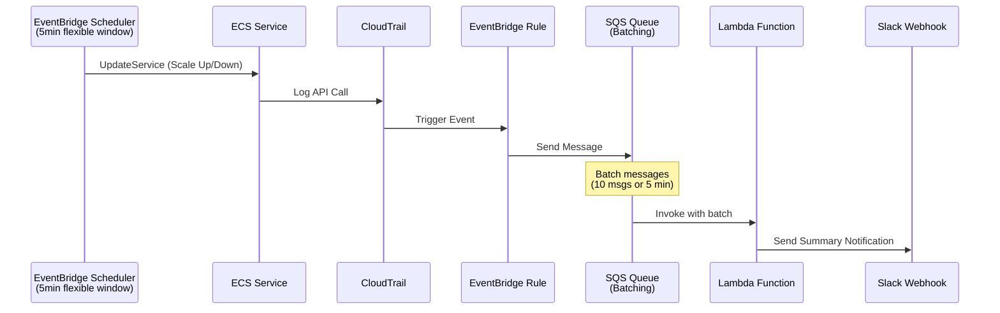

# Terraform ECS Scheduler Module

A modular Terraform project for managing ECS service scheduling (Scale Up/Down) with batched Slack notifications.

## Features

- **Flexible Time Window**: Distributes schedule execution over 5 minutes to prevent API throttling
- **Batched Notifications**: Aggregates multiple ECS events into a single Slack summary message
- **Multi-Environment**: Separate configurations for dev, stg, prod
- **Modular Design**: Reusable `ecs-scheduler` and `slack-notifier` modules

## Directory Structure

```
terraform-ecs-scheduler-module/
├── modules/
│   ├── ecs-scheduler/           # ECS scheduling module
│   │   ├── main.tf              # IAM Roles, EventBridge Schedule resources
│   │   ├── variables.tf
│   │   └── outputs.tf
│   └── slack-notifier/          # Slack notification module (SQS batching)
│       ├── main.tf              # SQS, Lambda, EventBridge Rule
│       ├── variables.tf
│       ├── outputs.tf
│       └── lambda/
│           └── index.py
├── environments/
│   ├── dev/                     # Development environment
│   └── stg/                     # Staging environment
└── README.md
```

## Architecture



## Usage

### 1. Select Environment

```bash
cd environments/dev   # or stg
```

### 2. Configure Backend

Each environment has its own `backend.tf` with Terraform Cloud workspace:
- dev: `ecs-scheduler-dev`
- stg: `ecs-scheduler-stg`

### 3. Initialize

```bash
terraform login
terraform init
```

### 4. Configure Variables

Set variables in Terraform Cloud workspace:
- `slack_webhook_url` (sensitive)
- `aws_account_id`

### 5. Plan and Apply

```bash
terraform plan
terraform apply
```

## Adding a New Service

Add the following block to `environments/<env>/main.tf`:

```hcl
module "new_service_scheduler" {
  source       = "../../modules/ecs-scheduler"
  service_name = "new-service"
  cluster_name = var.cluster_name
  environment  = var.environment

  # Optional: Custom cron expressions (KST timezone)
  # scale_up_cron   = "cron(0 9 ? * MON-FRI *)"
  # scale_down_cron = "cron(0 18 ? * MON-FRI *)"

  # Optional: Disable flexible time window (default: 5 minutes)
  # flexible_time_window_minutes = 0
}
```

> **Note**: `ecs_service_arn` is automatically generated from `service_name` and `cluster_name`.

## Module Variables

### ecs-scheduler

| Variable | Description | Default |
|----------|-------------|---------|
| `service_name` | ECS Service name | required |
| `cluster_name` | ECS Cluster name | required |
| `environment` | Environment name | `"dev"` |
| `scale_up_cron` | Scale up cron (KST) | `"cron(0 0 ? * MON-FRI *)"` |
| `scale_down_cron` | Scale down cron (KST) | `"cron(0 9 ? * MON-FRI *)"` |
| `scale_up_count` | Desired count for scale up | `1` |
| `scale_down_count` | Desired count for scale down | `0` |
| `flexible_time_window_minutes` | Flexible window (0=OFF) | `5` |

### slack-notifier

| Variable | Description | Default |
|----------|-------------|---------|
| `environment` | Environment name | required |
| `slack_webhook_url` | Slack Webhook URL | required |
| `name_prefix` | Resource name prefix | `"ecs-scheduler"` |
| `batch_size` | Max messages per batch | `10` |
| `batching_window_seconds` | Max wait time for batching (max 300) | `300` |

> **Note**: `batching_window_seconds` has a maximum value of 300 seconds (AWS Lambda Event Source Mapping limitation).

## Slack Notifications

### Summary Notification Example

```
✅ ECS Scheduled Scaling Completed

Environment: DEV
Total Services: 20 (20 succeeded, 0 failed)

Services:
✅ `nestjs` - Scale Up (-> 1)
✅ `python-api` - Scale Up (-> 1)
✅ `worker` - Scale Up (-> 1)
...

Time: 2025-01-15 09:05:00 KST
```

### Notification States

| State | Color | Description |
|-------|-------|-------------|
| All Succeeded | Green | All services scaled successfully |
| Partial Failure | Yellow | Some services failed |
| All Failed | Red | All services failed |

## Configuration Notes

- **Timezone**: Cron expressions use `Asia/Seoul` (KST)
- **Backend**: Terraform Cloud with per-environment workspaces
- **AWS Region**: `ap-northeast-2` (Seoul)
- **Terraform**: >= 1.6.0, AWS provider ~> 5.95.0
- **Batching**: Messages are batched for 5 minutes (max) or until 10 messages accumulate

## Known Issues

### Notifications may arrive separately when using flexible_time_window

When `flexible_time_window_minutes > 0`, EventBridge Scheduler executes each service at different times within the window. Combined with CloudTrail event delay (5-15 minutes), this can cause notifications to arrive separately for each service.

**Solution**: Set `flexible_time_window_minutes = 0` to execute all services at the exact same time:

```hcl
module "service_scheduler" {
  source                       = "../../modules/ecs-scheduler"
  # ...
  flexible_time_window_minutes = 0  # Execute at exact time
}
```

**Trade-off**: Disabling flexible time window may increase AWS API call concentration. For most use cases with a small number of services, this is not a concern.
