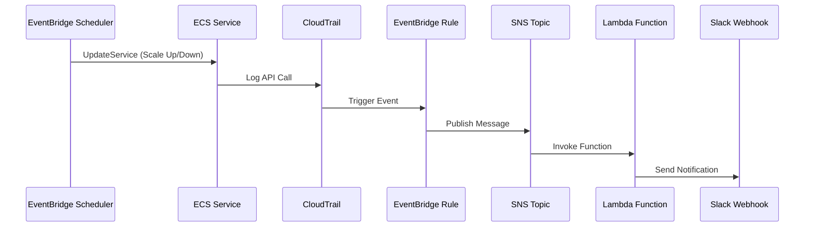

# Terraform ECS Scheduler Module

A modular Terraform project for managing ECS service scheduling (Scale Up/Down) and sending Slack notifications upon state changes.

## Directory Structure

```
terraform/
├── modules/
│   └── ecs-scheduler/       # Core module for ECS scheduling
│       ├── main.tf          # IAM Roles, EventBridge Schedule resources
│       ├── variables.tf     # Input variables
│       └── outputs.tf       # Output values
├── slack-notifier/          # Lambda function for Slack notifications
│   └── index.py
├── backend.tf               # Backend configuration (Terraform Cloud)
├── terraform.tf             # Terraform and provider version constraints
├── main.tf                  # Root configuration (SNS, Lambda, module calls)
├── variables.tf             # Global variables
├── terraform.tfvars         # Environment variables and settings (example)
└── .gitignore
```

## Architecture



## Usage

### 1. Backend Configuration

Update `backend.tf` with your Terraform Cloud settings:

```hcl
terraform {
  cloud {
    organization = "YOUR_ORGANIZATION_NAME"
    workspaces {
      name = "YOUR_WORKSPACE_NAME"
    }
  }
}
```

For S3 or local backend, uncomment the relevant section in `backend.tf`.

### 2. Initialize

```bash
terraform login
cd terraform
terraform init
```

### 3. Configure Variables

Edit `terraform.tfvars`:

```hcl
environment       = "dev"
slack_webhook_url = "https://hooks.slack.com/services/YOUR/WEBHOOK/URL"
```

### 4. Plan and Apply

```bash
terraform plan
terraform apply
```

### 5. Disable Scheduling for Specific Services

To modify only the Scale Down schedule for a specific service:

```bash
terraform apply -target=module.api_scheduler.aws_scheduler_schedule.scale_down
```

## Adding a New Service

Add the following block to `main.tf`:

```hcl
module "new_service_scheduler" {
  source          = "./modules/ecs-scheduler"

  service_name    = "new-service-dev"
  cluster_name    = aws_ecs_cluster.app-cluster-dev.name
  ecs_service_arn = aws_ecs_service.new-service-dev.id
  environment     = var.environment

  # Optional: Custom cron expressions (KST timezone)
  # scale_up_cron   = "cron(0 0 ? * MON-FRI *)"   # 00:00 KST
  # scale_down_cron = "cron(0 9 ? * MON-FRI *)"   # 09:00 KST
}
```

## Slack Notifications

Set the Webhook URL in `terraform.tfvars`:

```hcl
slack_webhook_url = "https://hooks.slack.com/services/YOUR/WEBHOOK/URL"
```

Notifications are sent for:
- ECS Scheduling Succeeded (SUCCEEDED)
- ECS Scheduling Failed (FAILED)

## Key Features

- **Modular Design**: Reuse scheduler settings with `modules/ecs-scheduler`
- **EventBridge Scheduler**: Uses `aws_scheduler_schedule` for reliable scheduling
- **Timezone Support**: `Asia/Seoul` timezone - cron expressions use KST time directly
- **Slack Integration**: Real-time execution results via Lambda and SNS
- **Flexible Backend**: Easy migration between Terraform Cloud, S3, or local backends

## Configuration Files

- `terraform.tf`: Terraform version and AWS provider configuration
- `backend.tf`: Backend configuration (separate for easy migration)
- `main.tf`: Main infrastructure and module instantiation
- `variables.tf`: Global variable definitions
- `terraform.tfvars`: Variable values (not committed to git)