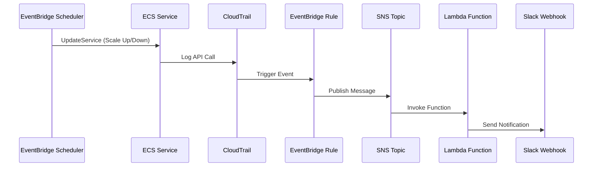

# Terraform ECS Scheduler Module

A modular Terraform project for managing ECS service scheduling (Scale Up/Down) and sending Slack notifications upon state changes.

## Directory Structure

```
terraform-ecs-scheduler-module/
├── modules/
│   ├── ecs-scheduler/           # ECS scheduling module
│   │   ├── main.tf              # IAM Roles, EventBridge Schedule resources
│   │   ├── variables.tf
│   │   └── outputs.tf
│   └── slack-notifier/          # Slack notification module
│       ├── main.tf              # SNS, Lambda, EventBridge Rule
│       ├── variables.tf
│       ├── outputs.tf
│       └── lambda/
│           └── index.py
├── environments/
│   ├── dev/                     # Development environment
│   ├── stg/                     # Staging environment
│   └── prod/                    # Production environment
└── README.md
```

## Flow



## Usage

### 1. Select Environment

```bash
cd environments/dev   # or stg, prod
```

### 2. Configure Backend

Each environment has its own `backend.tf` with Terraform Cloud workspace:
- dev: `ecs-scheduler-dev`
- stg: `ecs-scheduler-stg`

### 3. Initialize

```bash
terraform login
terraform init
```

### 4. Configure Variables

Set `slack_webhook_url` in Terraform Cloud workspace variables (sensitive).

Or edit `terraform.tfvars`:
```hcl
slack_webhook_url = "https://hooks.slack.com/services/YOUR/WEBHOOK/URL"
```

### 5. Plan and Apply

```bash
terraform plan
terraform apply
```

### 6. Target Specific Schedule

```bash
terraform apply -target=module.nestjs_scheduler.aws_scheduler_schedule.scale_down
```

## Adding a New Service

Add the following block to `environments/<env>/main.tf`:

```hcl
module "new_service_scheduler" {
  source          = "../../modules/ecs-scheduler"
  service_name    = "new-service"
  cluster_name    = var.cluster_name
  ecs_service_arn = "arn:aws:ecs:ap-northeast-2:ACCOUNT_ID:service/${var.cluster_name}/new-service"
  environment     = var.environment

  # Optional: Custom cron expressions (KST timezone)
  # scale_up_cron   = "cron(0 9 ? * MON-FRI *)"
  # scale_down_cron = "cron(0 18 ? * MON-FRI *)"
}
```

## Slack Notifications

Notifications are sent for:
- ECS Scheduling Succeeded
- ECS Scheduling Failed

## Key Features

- **Multi-Environment**: Separate configurations for dev, stg, prod
- **Modular Design**: Reusable `ecs-scheduler` and `slack-notifier` modules
- **EventBridge Scheduler**: Uses `aws_scheduler_schedule` for reliable scheduling
- **Timezone Support**: `Asia/Seoul` timezone - cron expressions use KST time directly
- **Slack Integration**: Real-time execution results via Lambda and SNS
- **Terraform Cloud**: Each environment has its own workspace
